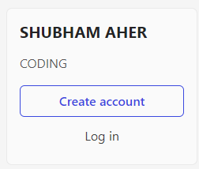
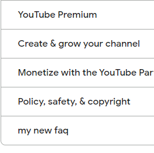
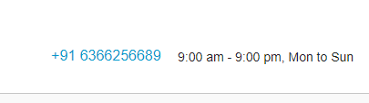
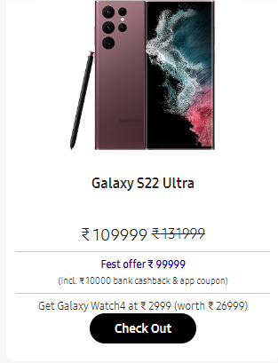
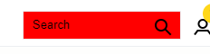
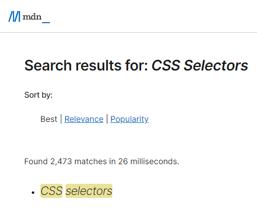

# Dom Manipulation Assignment

1. Webiste Name: [Dev To](https://dev.to/)

### Topics

    - Query Selctory, Inner HTML

### Sample Image


### Tasks

        Target the Top description div and change the DEV Community to <Your_Name> and description to your passion

### Output



### Code

```js
document.querySelector(
  ".crayons-layout .sidebar-wrapper .side-bar .crayons-card .crayons-subtitle-2"
).innerHTML = "SHUBHAM AHER";

document.querySelector(
  ".crayons-layout .sidebar-wrapper .side-bar .crayons-card  .color-base-70 "
).innerHTML = "CODING";
```

2. Website Name: [Apple](https://support.apple.com/en-in)

### Task


### Fetch all the product name and store in an array

### Output

['iPhone', 'Mac', 'iPad', 'Watch', 'AirPods', 'Music', 'TV']

### code :
```js
let elements = document.getElementsByClassName("as-imagegrid-item-title");
let data = []
for (var i = 0, len = elements.length; i < len; i++) {
    arr[i] = elements[i].textContent
}
console.log(data)
```

3. Webiste Name: [Youtube Support](https://support.google.com/youtube/)

### Topics

    - Get Element By Id, Create Element, Create Text Node, Append Child

### Sample Image


### Tasks

     Add another FAQ 'My New FAQ' to the list

### Output



```js
let navbar = document.querySelector(".accordion-homepage");
let section = document.createElement("section");
section.classList = "parent";
let h3 = document.createElement("h3");
h3.innerHTML = "my new faq";
section.appendChild(h3);
navbar.appendChild(section);
```

4. Webiste Name: [OnePlus](https://www.oneplus.in/support)

### Topics

     Query Selector, InnerText

### Sample Image


### Tasks

      Change the contact number

### Output



```js
document.querySelector(".customer-support .one-tel-number").innerHTML =
  "+91 6366256689";
```

5. Webiste Name: [Samsung](https://www.samsung.com/in/offer/online/samsung-fest/)

### Topics

       getElementById, createElement, InnerText, append, setAttribute

### Sample Image


### Tasks

     Target the main div of card and change the Button text to Check out

### Output



```js
document.querySelector(
  ".mytabs .diwali-deals-product-sale-pro .diwali-deals-product-sale-btn"
).innerHTML = "Check Out";
```

6. Webiste Name: [Adidas](https://www.adidas.co.in/)

### Topics

    -   Query Selector, Event listeners, Changing Styles

### Sample Image


### Tasks

     Target the search box and on hover change thebackground color to red.

### Output



```js
let button = document.querySelector(".searchinput___19uW0");

button.style.backgroundColor = "red";
```

7. Webiste Name: [MDN Web Docs](https://developer.mozilla.org/en-US/)

### Topics

       Form, Value, Submit

### Sample Image


### Tasks

     To Search a topic in the MDN Search bar.
     First add a text to search in the search bar and then hit the submit search button to search the docs using DOM

### Output



```js
document.getElementById("hp-search-input").value = "CSS Selectors";
document.getElementById("hp-search-form").submit()
```

8. Webiste Name: [Google](https://www.google.com/)

### Topics

       Remove Elements

### Sample Image


### Tasks

     Remove alternate languages from the home page languages listed

### Output


```js
let langs = document.getElementById("SIvCob").childNodes;
for(let i = 3; i < langs.length; i++){
    langs[i].remove();
}
```

9. Webiste Name: [Code Wars](https://www.codewars.com/)

### Topics

       Change Font Family, Color of Text.

### Sample Image


### Tasks

    Change the font family of the text to monospace and text color to the logo’s background color.

### Output


```js
let heading = document.querySelector(".display-heading-1");
heading.style.fontFamily = "monospace";
heading.style.color = "#ff1a1a";
```

10. Webiste Name: [Freecodecamp](https://www.freecodecamp.org/)

### Topics

       querySelector, mouseover, click eventListener,  callback function, style,

### Sample Image


### Tasks

    Target the button and change background colour on mouseover

### Output


```js
let allbtn = document.querySelectorAll(".login-btn-text");
allbtn[1].style.backgroundColor = "#ed2fe9";
```

11. Webiste Name: [realme](https://www.realme.com/in/)

### Topics

       querySelector,style,background-image

### Sample Image


### Tasks

    change the realme logo to ineuron logo

### Output


```js
let logo = document.getElementsByClassName("icon-logo")
logo[0].style.backgroundImage = "url('https://account.ineuron.ai/static/images/ineuron-logo.png')";
```

12. Webiste Name: [Github](https://github.com/)

### Topics

       querySelector,style,background-Color

### Sample Image


### Tasks

     change the background colour of the button to blue.

### Output


```js
let btn = document.getElementsByClassName("btn btn-sm btn-primary");
let bluebtn = btn[1];
bluebtn.style.backgroundColor = "#1d00ff";
```

13. Webiste Name: [Hackerrank](https://www.hackerrank.com/)

### Topics

       querySelector,innerHtml

### Sample Image


### Tasks

Target the top description and change “Matching developers with great companies” to ‘JSBOOTCAMP“.

### Output


```js
document.querySelector(".fl-heading .fl-heading-text").innerHTML ="JS bootcamp"
```

14. Webiste Name: [Asus](https://www.asus.com/in/)

### Topics

      querySelector,style,font-size

### Sample Image


### Tasks

       change the fontsize of “Hot Deals” to 80px

### Output


```js
document.querySelector(".HotDealsAll__Heading__2fIbe").style.fontSize = "80px"
```

15. Webiste Name: [Dell](https://www.dell.com/en-in/shop/deals/laptop-deals?gacd=10415953-9016-5761040-285981356-0&dgc=ST&gclid=Cj0KCQjwguGYBhDRARIsAHgRm4-XUDMhhVNyHXb3s1gY4ZBzORr_d9Se-buhJwy7asyUe7YdqEA11eEaAt6UEALw_wcB&gclsrc=aw.ds&nclid=BxjBlpBQsX6pjSHh-L8YYSU77EpfXRkG1AGMB5Wbeu386ykspfrPDnfx_DdFau20)

### Topics

      querySelector,style.textAlign

### Sample Image


### Tasks

       Convert the text “G15 Gaming Laptop” from left to right

### Output


```js
let g15 = document.querySelectorAll(".ps-title");
for(i = 0; i < g15.length; i++){
    if(g15[i].innerText == "G15 Gaming Laptop"){
        g15[i].style.textAlign = "right";
        console.log(g15[i])
    }
    else continue;
}
```

16. Webiste Name: [Vercel](https://vercel.com/)

### Topics

     querySelector,innerHTMl

### Sample Image


### Tasks

      change the heading “Start with the developer” to “Start with Scratch”

### Output


```js
let head = document.querySelector(".section-title_title__VEDfK")
head.innerText = "Start with Scratch"
```

17. Webiste Name: [Sony](https://www.sony.co.in/)

### Topics

    querySelector,innerHTMl

### Sample Image


### Tasks

     change the button text To current Date.

### Output


```js
let today = new Date;
let btn = document.querySelector(".PrimaryTout__ButtonText");
btn.innerText = today
```

18. Webiste Name: [Philips](https://www.philips.co.in/)

### Topics

     querySelector,style,backgroundcolor

### Sample Image


### Tasks

    change the background colour blue to orange

### Output


```js
let foot2 = document.querySelector(".p-footer")
foot2.style.background = "#ff7f00"
```

19. Webiste Name: [Canon](https://in.canon/)

### Topics

          querySelector,src

### Sample Image


### Tasks

    extract the canon logo

### Output


```js
document.querySelector(".logo").src
```
20. Webiste Name: [Oppo](https://www.oppo.com/in/)

### Topics

          querySelector,style,color

### Sample Image


### Tasks

      Change the description colour black to orange

### Output


```js
let desc = document.querySelector(".desc");
desc.style.color = "orange";
```